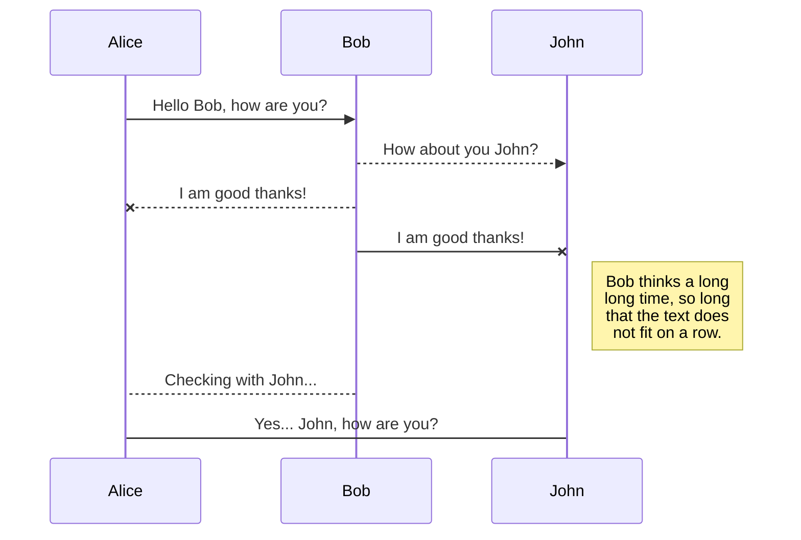
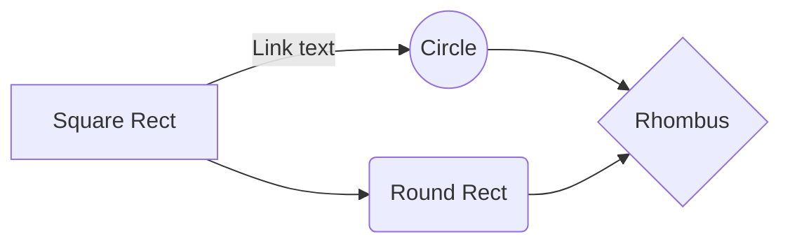

# Markdow
# h1

## h2

_ cursiva _

** negrita **

*** cursiva con negrita ***

> Esto es una cita
> continuación de la cita

- lista desordenada 1
* lista desordenada 2
+ lista desordenada 3

1. lista ordenada 1
2. lista ordenada 2
3. lista ordenada 3
    - sub elemento 3.1

___

[enlace](https://www.google.com "google")

<https://www.google.com>

    esto es código de una línea
    
~~~ 
esto es el código de varias líneas debido a que no entra en una sola 
~~~

También puedes usar `código` así

De ésta forma \*anulas Markdown

## SmartyPants

SmartyPants converts ASCII punctuation characters into "smart" typographic punctuation HTML entities. For example:

|                |ASCII                          |HTML                         |
|----------------|-------------------------------|-----------------------------|
|Single backticks|`'Isn't this fun?'`            |'Isn't this fun?'            |
|Quotes          |`"Isn't this fun?"`            |"Isn't this fun?"            |
|Dashes          |`-- is en-dash, --- is em-dash`|-- is en-dash, --- is em-dash|

## KaTeX

You can render LaTeX mathematical expressions using [KaTeX](https://khan.github.io/KaTeX/):

The *Gamma function* satisfying $\Gamma(n) = (n-1)!\quad\forall n\in\mathbb N$ is via the Euler integral

$$
\Gamma(z) = \int_0^\infty t^{z-1}e^{-t}dt\,.
$$

> You can find more information about **LaTeX** mathematical expressions [here](http://meta.math.stackexchange.com/questions/5020/mathjax-basic-tutorial-and-quick-reference).

## UML diagrams

You can render UML diagrams using [Mermaid](https://mermaidjs.github.io/). For example, this will produce a sequence diagram:

And this will produce a flow chart:

<!--stackedit_data:
eyJoaXN0b3J5IjpbOTg3NjYyOTY5XX0=
-->